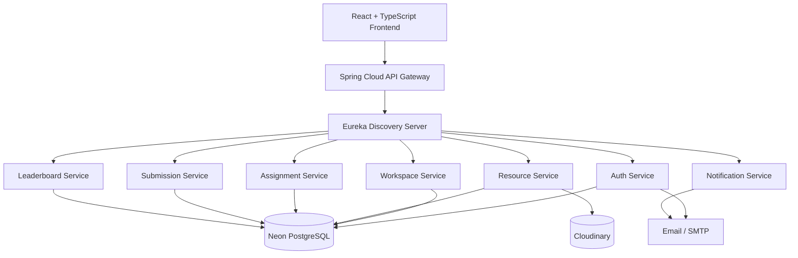
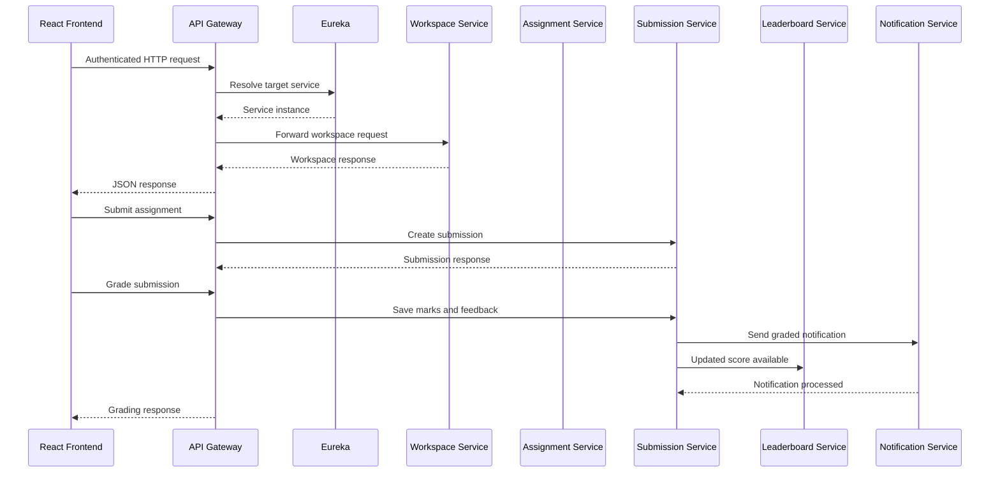
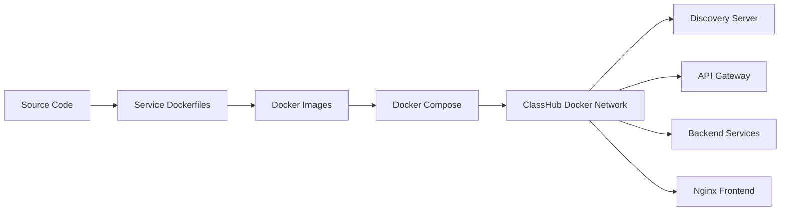
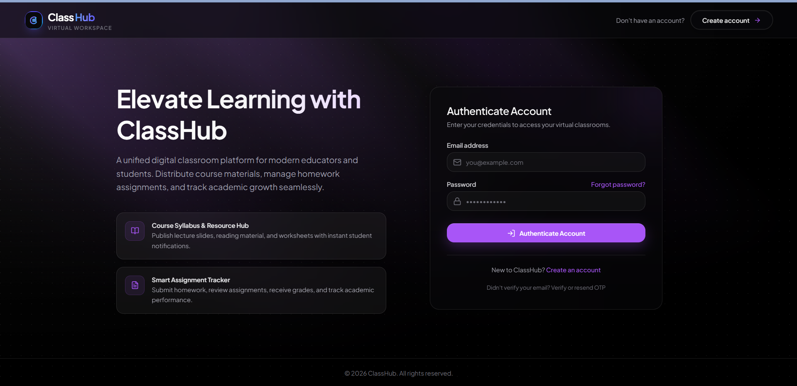
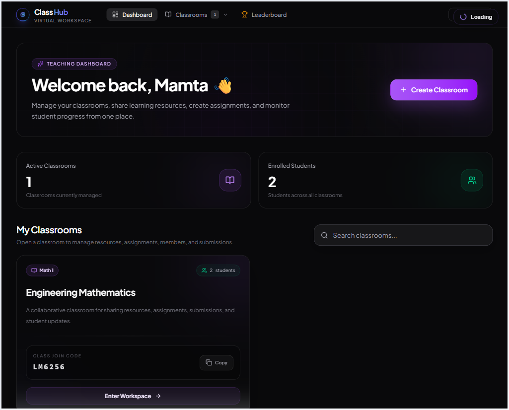
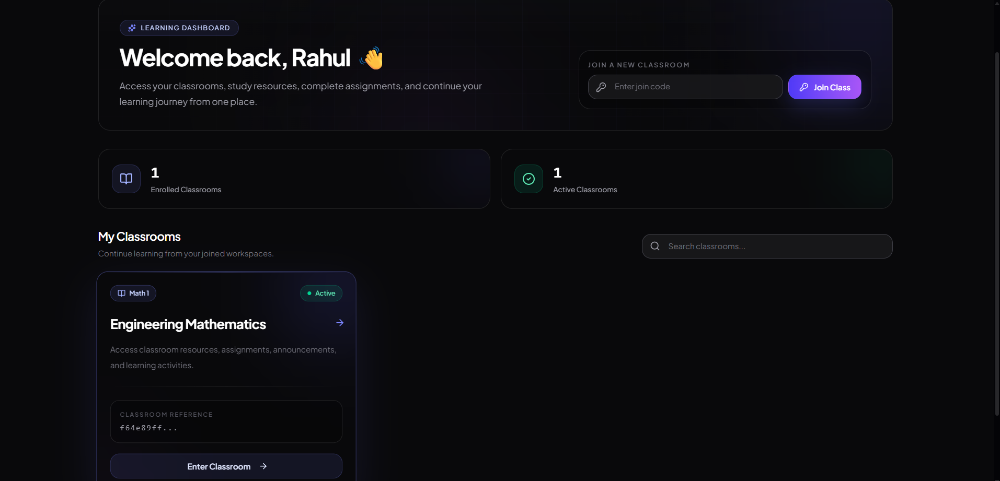
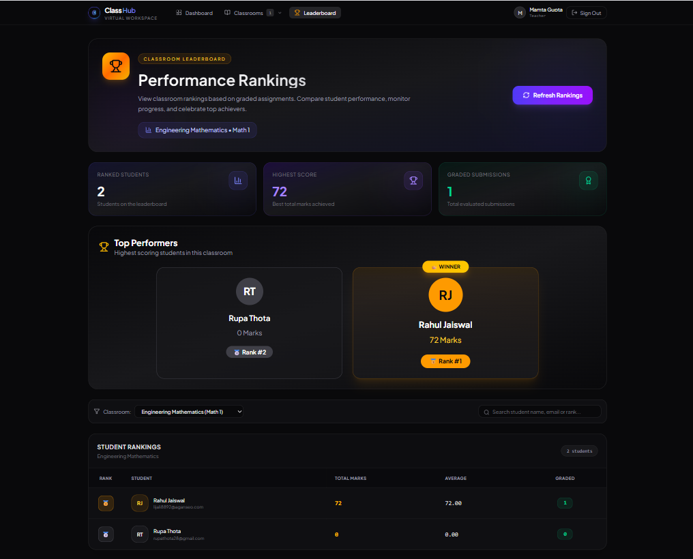

<div align="center">

# 🎓 ClassHub

### A Microservices-Based Virtual Classroom and Learning Management Platform

<p>
  Create classrooms, share resources, manage assignments, evaluate submissions,
  send notifications, and track student performance from one platform.
</p>

[](https://www.java.com/)
[](https://spring.io/projects/spring-boot)
[](https://react.dev/)
[](https://www.typescriptlang.org/)
[](https://www.docker.com/)
[](https://www.postgresql.org/)

<br/>


</div>

---

## 📑 Table of Contents

- [About ClassHub](#-about-classhub)
- [Problem Statement](#-problem-statement)
- [Solution](#-solution)
- [Main Features](#-main-features)
- [User Roles](#-user-roles)
- [Architecture](#️-architecture)
- [Microservices](#-microservices)
- [Communication Flow](#-communication-flow)
- [Technology Stack](#️-technology-stack)
- [Project Structure](#-project-structure)
- [Prerequisites](#-prerequisites)
- [Environment Variables](#-environment-variables)
- [Run with Docker](#-run-with-docker-recommended)
- [Run without Docker](#-run-without-docker)
- [Service URLs](#-service-urls)
- [Testing the Application](#-testing-the-application)
- [Docker Commands](#-useful-docker-commands)
- [Security](#-security)
- [Screenshots](#-screenshots)
- [Future Enhancements](#-future-enhancements)
- [Project Team](#-project-team)
- [License](#-license)

---

## 📖 About ClassHub

**ClassHub** is a full-stack virtual classroom platform built using a Spring Boot microservices architecture and a React frontend.

The platform allows teachers to create dedicated course workspaces and invite students using unique join codes. Teachers can upload course resources, create assignments, review student submissions, assign grades, and monitor student performance.

Students can join workspaces, access learning resources, submit assignments, view grades, and compare their performance through a workspace leaderboard.

ClassHub is containerized using Docker and can be started locally using a single Docker Compose command.

---

## 🎯 Problem Statement

In many institutes, course material and assignments are shared through WhatsApp groups, email threads, or general-purpose classroom tools.

This creates several problems:

- Students must search through many messages to find resources.
- Assignments and submissions are difficult to organize.
- Teachers cannot easily track submissions across multiple subjects.
- Course resources from different teachers become mixed together.
- Students lack a unified place to monitor grades and performance.
- Manual communication is required for assignment, resource, and grading updates.

---

## 💡 Solution

ClassHub provides separate workspaces for each teacher or subject.

A teacher can:

1. Create a workspace.
2. Share the generated join code.
3. Upload resources.
4. Create assignments.
5. View student submissions.
6. Grade submitted work.
7. Track student rankings.

A student can:

1. Register and verify an email address.
2. Join a workspace using its join code.
3. Access classroom-specific resources.
4. View and submit assignments.
5. View grades and feedback.
6. Check the workspace leaderboard.

---

## ✨ Main Features

### 🔐 Authentication and Account Management

- User registration
- Email OTP verification
- Resend OTP
- Secure login
- JWT access token
- Refresh token
- Forgot password
- Reset password
- Change password
- Password encryption
- Role-based authorization
- Protected frontend routes

### 🏫 Workspace Management

- Teachers can create multiple workspaces
- Unique join code for each workspace
- Students can join using a code
- Teacher-specific classroom management
- Workspace member listing
- Join-code regeneration
- Workspace update and deletion
- Workspace access validation

### 📚 Resource Management

- Upload course resources
- PDF, document, presentation, image, video, and archive support
- Cloudinary-based storage
- Resource title and description
- Open resource in a new tab
- Update resource information
- Delete uploaded resources
- Workspace-specific resource listing

### 📝 Assignment Management

- Teachers can create assignments
- Assignment title and description
- Due date
- Maximum marks
- Workspace-specific assignments
- Update assignment
- Delete assignment
- Teacher and student assignment views

### 📤 Submission Management

- Students can submit assignments
- Update an existing submission
- Teacher submission review
- Marks and feedback
- Submission status tracking
- Delete submission
- Student submission history

### 🏆 Leaderboard

- Workspace-wise ranking
- Ranking by total marks
- Top-performer cards
- Student score summary
- Graded submission count
- Search students by name, email, ID, or rank

### 📧 Notifications

Email notifications for:

- Account verification
- New assignments
- New resources
- Graded submissions
- Teacher feedback

### 🎨 User Interface

- Responsive React interface
- Teacher dashboard
- Student dashboard
- Workspace detail page
- Leaderboard page
- Loading indicators
- Skeleton loaders
- Toast notifications
- Confirmation dialogs
- Empty states
- Error boundaries
- Mobile navigation

---

## 👥 User Roles

### 👨‍🏫 Teacher

Teachers can:

- Create and manage workspaces
- Generate workspace join codes
- Upload and delete resources
- Create, update, and delete assignments
- View student submissions
- Grade submissions
- Provide feedback
- View workspace leaderboards

### 👨‍🎓 Student

Students can:

- Join a workspace
- View enrolled workspaces
- Access and download resources
- View assignments
- Create and update submissions
- View marks and teacher feedback
- View workspace rankings

> An Admin module is planned as a future enhancement.

---

## 🏗️ Architecture



---

## 🔄 Microservices Communication Flow



---

## 🐳 Docker Workflow



The complete project can be started using:

```bash
docker compose up --build -d
```

---

## 🧩 Microservices

| Service | Responsibility | Port |
|---|---|---:|
| Discovery Server | Service registration and discovery | `8761` |
| API Gateway | Central routing and request forwarding | `8080` |
| Auth Service | Registration, login, OTP, JWT and passwords | `8081` |
| Workspace Service | Workspaces, members and join codes | `8082` |
| Resource Service | Cloudinary resource upload and management | `8083` |
| Assignment Service | Assignment creation and management | `8084` |
| Submission Service | Student submissions, grading and feedback | `8085` |
| Leaderboard Service | Workspace ranking and score aggregation | `8086` |
| Notification Service | Assignment, resource and grading emails | `8087` |
| React Frontend | User interface served through Nginx | `3000` |

---

## 🛠️ Technology Stack

### Backend

| Technology | Usage |
|---|---|
| Java 21 | Backend language |
| Spring Boot | Microservice development |
| Spring Security | Authentication and authorization |
| Spring Cloud Gateway | API routing |
| Netflix Eureka | Service discovery |
| Spring Data JPA | Persistence |
| Hibernate | ORM |
| OpenFeign | Inter-service communication |
| JWT | Token-based authentication |
| Maven | Dependency management |
| PostgreSQL | Relational database |

### Frontend

| Technology | Usage |
|---|---|
| React 19 | Frontend library |
| TypeScript | Type-safe development |
| Vite | Frontend build tool |
| Tailwind CSS | Styling |
| React Router | Navigation |
| Axios | HTTP requests |
| Motion | UI animations |
| Lucide React | Icons |
| Nginx | Production frontend server |

### Infrastructure and External Services

| Technology | Usage |
|---|---|
| Docker | Service containerization |
| Docker Compose | Multi-container orchestration |
| Neon | Managed PostgreSQL databases |
| Cloudinary | File and media storage |
| Gmail SMTP | Email delivery |
| GitHub | Source-code management |

---

## 📂 Project Structure

```text
ClassHub/
│
├── api-gateway/
│   ├── src/
│   ├── Dockerfile
│   ├── .dockerignore
│   └── pom.xml
│
├── auth-service/
│   ├── src/
│   ├── Dockerfile
│   ├── .dockerignore
│   └── pom.xml
│
├── discovery-server/
│   ├── src/
│   ├── Dockerfile
│   ├── .dockerignore
│   └── pom.xml
│
├── workspace-service/
│   ├── src/
│   ├── Dockerfile
│   ├── .dockerignore
│   └── pom.xml
│
├── resource-service/
│   ├── src/
│   ├── Dockerfile
│   ├── .dockerignore
│   └── pom.xml
│
├── assignment-service/
│   ├── src/
│   ├── Dockerfile
│   ├── .dockerignore
│   └── pom.xml
│
├── submission-service/
│   ├── src/
│   ├── Dockerfile
│   ├── .dockerignore
│   └── pom.xml
│
├── leaderboard-service/
│   ├── src/
│   ├── Dockerfile
│   ├── .dockerignore
│   └── pom.xml
│
├── notification-service/
│   ├── src/
│   ├── Dockerfile
│   ├── .dockerignore
│   └── pom.xml
│
├── classhub-frontend/
│   ├── src/
│   ├── Dockerfile
│   ├── nginx.conf
│   ├── package.json
│   └── vite.config.ts
│
├── docs/
│   └── screenshots/
│
├── docker-compose.yml
├── .env.example
├── .gitignore
├── LICENSE
└── README.md
```

---

## ✅ Prerequisites

### Option 1: Run with Docker — Recommended

Install:

- Docker Desktop
- Git

Java, Maven, Node.js, and Nginx are provided by the Docker build images and do not need to be installed separately.

### Option 2: Run without Docker

Install:

- Java 21
- Maven or Maven Wrapper support
- Node.js 22+
- npm
- Git

---

## 🔑 Environment Variables

Create a file named:

```text
.env
```

in the project root.

Never commit the real `.env` file.

The exact variable names must match the placeholders used in each service’s `application.yml`.

Example:

```env
# ============================
# Auth Service Database
# ============================

DB_URL=jdbc:postgresql://HOST/DATABASE?sslmode=require
DB_USERNAME=YOUR_AUTH_DB_USERNAME
DB_PASSWORD=YOUR_AUTH_DB_PASSWORD

# ============================
# Workspace Service Database
# ============================

WORKSPACE_DB_URL=jdbc:postgresql://HOST/DATABASE?sslmode=require
WORKSPACE_DB_USERNAME=YOUR_WORKSPACE_DB_USERNAME
WORKSPACE_DB_PASSWORD=YOUR_WORKSPACE_DB_PASSWORD
EUREKA_URL=

# ============================
# Resource Service Database
# ============================

RESOURCE_DB_URL=jdbc:postgresql://HOST/DATABASE?sslmode=require
RESOURCE_DB_USERNAME=YOUR_RESOURCE_DB_USERNAME
RESOURCE_DB_PASSWORD=YOUR_RESOURCE_DB_PASSWORD

# ============================
# Assignment Service Database
# ============================

ASSIGNMENT_DB_URL=jdbc:postgresql://HOST/DATABASE?sslmode=require
ASSIGNMENT_DB_USERNAME=YOUR_ASSIGNMENT_DB_USERNAME
ASSIGNMENT_DB_PASSWORD=YOUR_ASSIGNMENT_DB_PASSWORD

# ============================
# Submission Service Database
# ============================

SUBMISSION_DB_URL=jdbc:postgresql://HOST/DATABASE?sslmode=require
SUBMISSION_DB_USERNAME=YOUR_SUBMISSION_DB_USERNAME
SUBMISSION_DB_PASSWORD=YOUR_SUBMISSION_DB_PASSWORD


# ============================
# Security
# ============================

JWT_SECRET=REPLACE_WITH_A_LONG_RANDOM_SECRET

# ============================
# Email
# ============================

MAIL_USERNAME=YOUR_EMAIL_ADDRESS
MAIL_PASSWORD=YOUR_GMAIL_APP_PASSWORD

# ============================
# Cloudinary
# ============================

CLOUDINARY_CLOUD_NAME=YOUR_CLOUDINARY_CLOUD_NAME
CLOUDINARY_API_KEY=YOUR_CLOUDINARY_API_KEY
CLOUDINARY_API_SECRET=YOUR_CLOUDINARY_API_SECRET
```

Some services may use different variable names. Check:

```text
service-name/src/main/resources/application.yml
```

and ensure every `${VARIABLE_NAME}` is present in `.env`.

### `.env.example`

You should commit a safe template named `.env.example` without real credentials.

```env
AUTH_DB_URL=
AUTH_DB_USERNAME=
AUTH_DB_PASSWORD=

WORKSPACE_DB_URL=
WORKSPACE_DB_USERNAME=
WORKSPACE_DB_PASSWORD=

RESOURCE_DB_URL=
RESOURCE_DB_USERNAME=
RESOURCE_DB_PASSWORD=

ASSIGNMENT_DB_URL=
ASSIGNMENT_DB_USERNAME=
ASSIGNMENT_DB_PASSWORD=

SUBMISSION_DB_URL=
SUBMISSION_DB_USERNAME=
SUBMISSION_DB_PASSWORD=

LEADERBOARD_DB_URL=
LEADERBOARD_DB_USERNAME=
LEADERBOARD_DB_PASSWORD=

JWT_SECRET=

MAIL_USERNAME=
MAIL_PASSWORD=

CLOUDINARY_CLOUD_NAME=
CLOUDINARY_API_KEY=
CLOUDINARY_API_SECRET=
```

Ensure `.gitignore` contains:

```gitignore
.env
**/.env
```

---

## 🐳 Run with Docker — Recommended

### 1. Clone the repository

```bash
git clone https://github.com/YOUR_GITHUB_USERNAME/YOUR_REPOSITORY_NAME.git
```

Enter the project:

```bash
cd YOUR_REPOSITORY_NAME
```

### 2. Create the environment file

Copy the example file.

#### Windows PowerShell

```powershell
Copy-Item .env.example .env
```

#### Linux or macOS

```bash
cp .env.example .env
```

Add your real credentials to `.env`.

### 3. Verify Docker

```bash
docker --version
docker compose version
```

### 4. Validate Docker Compose

```bash
docker compose config --quiet
```

No output means the Compose configuration is valid.

### 5. Build and start everything

```bash
docker compose up --build -d
```

The first build may take several minutes because Docker must download Java, Maven, Node.js, and Nginx images.

### 6. Check container status

```bash
docker compose ps
```

All ClassHub containers should display an `Up` status.

### 7. View logs

```bash
docker compose logs -f
```

View one service:

```bash
docker compose logs -f auth-service
```

### 8. Open the application

Frontend:

```text
http://localhost:3000
```

Eureka dashboard:

```text
http://localhost:8761
```

API Gateway:

```text
http://localhost:8080
```

### 9. Stop the application

```bash
docker compose down
```

---

## 💻 Run without Docker

Start the backend services in this order:

```text
1. Discovery Server
2. Auth Service
3. Workspace Service
4. Resource Service
5. Assignment Service
6. Submission Service
7. Leaderboard Service
8. Notification Service
9. API Gateway
10. React Frontend
```

### Start a Spring Boot service

Enter a service directory:

```bash
cd auth-service
```

#### Windows

```powershell
.\mvnw.cmd spring-boot:run
```

#### Linux or macOS

```bash
./mvnw spring-boot:run
```

Repeat this for the remaining Spring Boot services.

### Start the frontend

```bash
cd classhub-frontend
npm install
npm run dev
```

The frontend starts on:

```text
http://localhost:3000
```

---

## 🌐 Service URLs

| Component | URL |
|---|---|
| Frontend | `http://localhost:3000` |
| API Gateway | `http://localhost:8080` |
| Auth Service | `http://localhost:8081` |
| Workspace Service | `http://localhost:8082` |
| Resource Service | `http://localhost:8083` |
| Assignment Service | `http://localhost:8084` |
| Submission Service | `http://localhost:8085` |
| Leaderboard Service | `http://localhost:8086` |
| Notification Service | `http://localhost:8087` |
| Eureka Dashboard | `http://localhost:8761` |

> The frontend communicates with backend services through the API Gateway.

---

## 🧪 Testing the Application

Use this order for a complete end-to-end test.

### Teacher flow

1. Register a teacher account.
2. Verify the account using the email OTP.
3. Log in.
4. Create a workspace.
5. Copy the workspace join code.
6. Upload a resource.
7. Create an assignment.

### Student flow

1. Register a student account.
2. Verify the account.
3. Log in.
4. Join the workspace using the code.
5. Open the uploaded resource.
6. View the assignment.
7. Submit the assignment.

### Grading flow

1. Log in as the teacher.
2. Open the workspace.
3. View the student submission.
4. Enter marks and feedback.
5. Submit the grade.
6. Verify the grading email.
7. Open the leaderboard.
8. Confirm that the student score is updated.

---

## 🐳 Useful Docker Commands

### Start all containers

```bash
docker compose up -d
```

### Start and rebuild

```bash
docker compose up --build -d
```

### Stop containers without removing them

```bash
docker compose stop
```

### Start existing containers

```bash
docker compose start
```

### Restart one service

```bash
docker compose restart workspace-service
```

### Rebuild one service

```bash
docker compose up --build -d workspace-service
```

### View all logs

```bash
docker compose logs -f
```

### View recent logs

```bash
docker compose logs --tail=100
```

### View one service’s logs

```bash
docker compose logs -f submission-service
```

### Remove Compose containers and network

```bash
docker compose down
```

### List running containers

```bash
docker ps
```

### List Docker images

```bash
docker images
```

---

## 🔐 Security

ClassHub includes:

- JWT access-token authentication
- Refresh-token support
- Stateless backend sessions
- BCrypt password encryption
- Email OTP verification
- Role-based access control
- Teacher and student route guards
- Protected API endpoints
- Centralized exception handling
- Request validation
- Secure environment-variable configuration
- Secrets excluded from Git
- Gateway-based backend access

Never commit:

- Database credentials
- JWT secrets
- Gmail passwords
- Cloudinary API secrets
- `.env` files
- Private keys
- Service-account credentials

---

## 📸 Screenshots


```


```


### Login



### Teacher Dashboard



### Student Dashboard



### Leaderboard




---


## 👥 Project Team

Replace the placeholder entries with actual details.

| Team Member | Role | Contributions | GitHub |
|---|---|---|---|
| **Kushagra Gupta** | Team Lead / Full-Stack Developer | Architecture, authentication, frontend integration, Docker, deployment | [GitHub](https://github.com/kush788) |
| **Pramod Gautam** | Backend Developer | Assignment and Submission Microservice and some Frontend Design | [GitHub](https://github.com/thepramodgautam) |
| **Rupa Thota** | Full-Stack Developer | Resouce Microservice and Student and Teacher Dashboard Design | [GitHub](https://github.com/SriRanganath-cyber) |
| **Raj Karsayal** | Frontend Developer | Notification and Leaderboard Microservice, Leaderboard Frontend Design | [GitHub](https://github.com/rajkarsayal08) |


### Contributors

Thanks to every team member who contributed code, testing, documentation, design, and feedback.

<a href="https://github.com/YOUR_GITHUB_USERNAME/YOUR_REPOSITORY_NAME/graphs/contributors">
  
</a>

---

## 🤝 Contributing

Team members should avoid pushing directly to `main`.

### Create a branch

```bash
git switch -c feature/feature-name
```

### Add and commit changes

```bash
git add .
git commit -m "Add feature description"
```

### Push the branch

```bash
git push -u origin feature/feature-name
```

Create a Pull Request on GitHub and merge it after review.

Before committing, configure your Git identity:

```bash
git config --global user.name "Your Name"
git config --global user.email "YOUR_GITHUB_EMAIL"
```

The email should be connected to your GitHub account so that GitHub attributes the contribution correctly.

---

## 📄 License

This project is licensed under the MIT License.

See the `LICENSE` file for details.

---

## 📬 Contact

### Kushagra Gupta

- GitHub: [Kush788](https://github.com/kush788)
- LinkedIn: [Kushagra Gupta](linkedin.com/in/kushagra-gupta-040b0a26a/)
- Email: `kushagragupta909@gmail.com`
- Program: PG-DAC
- Institute: CDAC Hyderabad

---

<div align="center">

## ⭐ Support ClassHub

If you found this project useful, consider giving the repository a star.

**Built with Java, Spring Boot, React, PostgreSQL and Docker.**


</div>
